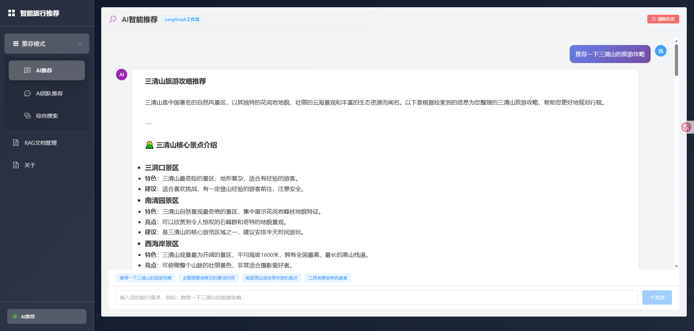
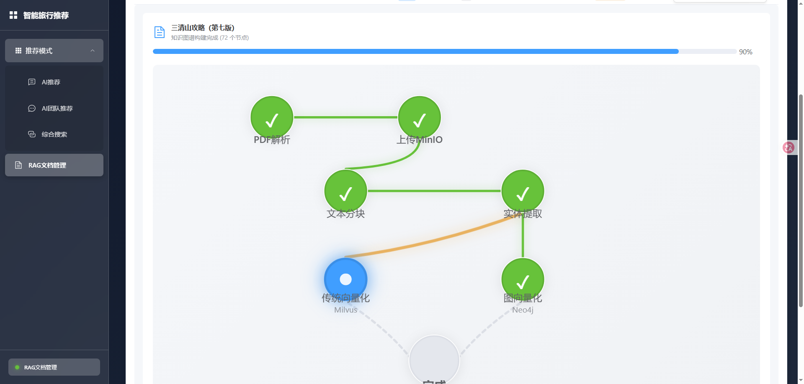
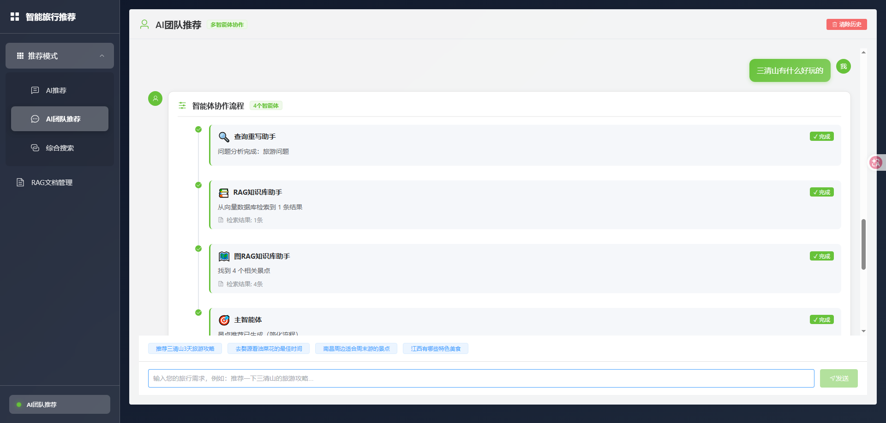
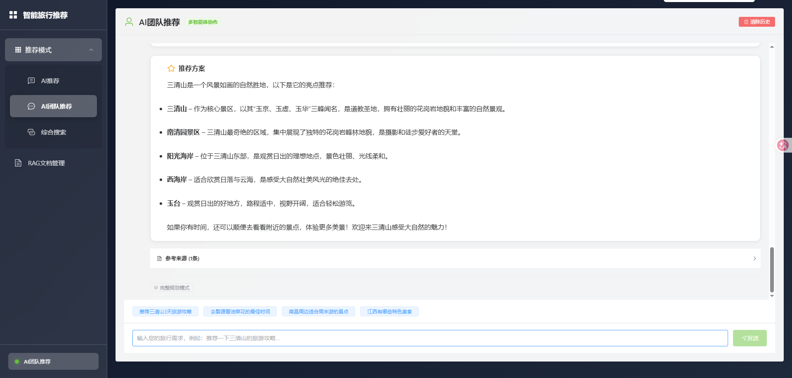
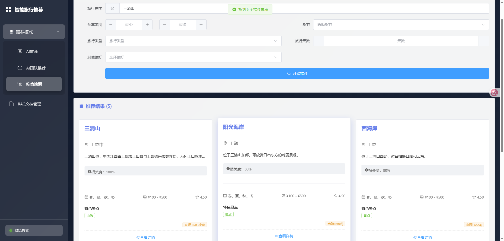

# 智能旅行推荐系统

<div align="center">



**基于 RAG + GraphRAG + RRF + Rerank 技术栈的智能旅游目的地推荐系统**

[](https://www.python.org/downloads/)
[](https://fastapi.tiangolo.com/)
[](https://vuejs.org/)
[](LICENSE)

[在线演示](http://fz12580.com:8856) · [报告问题](https://github.com/057i/traveler_llm/issues) · [功能请求](https://github.com/057i/traveler_llm/issues)

</div>

---

## 📖 目录

- [项目简介](#项目简介)
- [核心特性](#核心特性)
- [技术架构](#技术架构)
- [系统截图](#系统截图)
- [快速开始](#快速开始)
- [部署指南](#部署指南)
- [项目结构](#项目结构)
- [开发文档](#开发文档)
- [常见问题](#常见问题)
- [贡献指南](#贡献指南)
- [许可证](#许可证)

---

## 🎯 项目简介

智能旅行推荐系统是一个基于大语言模型和知识图谱的智能旅游推荐平台。系统结合了传统的向量检索（RAG）和图数据库检索（GraphRAG），通过倒排融合（RRF）和重排序（Rerank）技术，为用户提供个性化、精准的旅游目的地推荐。

### ⚠️ 注意事项

> **服务器配置限制：** 因服务器配置不足，在线演示环境无法完整运行模型功能。若需体验完整功能，请克隆项目到本地运行。

```bash
git clone https://github.com/057i/traveler_llm.git
```

---

## ✨ 核心特性

### 🤖 智能推荐引擎
- **RAG检索**：基于向量数据库的语义检索
- **GraphRAG检索**：利用知识图谱的关系推理
- **RRF融合**：多路召回结果的智能融合
- **Rerank重排**：基于相关性的结果优化

### 📊 多模式推荐
- **AI推荐**：单路大模型推荐，支持SSE流式输出
- **AI团队推荐**：多Agent协同推荐，基于WebSocket实时通信
- **综合搜索**：融合向量检索、图检索、RRF和Rerank

### 📄 文档管理
- **PDF上传**：支持旅游景点相关PDF文档上传
- **自动解析**：利用MinerU API自动解析PDF内容
- **向量化**：自动生成向量并存储到Milvus
- **图谱构建**：自动提取实体关系并存入Neo4j
- **在线预览**：支持PDF在线查看

### 🎨 用户界面
- **现代化设计**：基于Element Plus的响应式UI
- **渐变色主题**：美观的视觉体验
- **实时反馈**：WebSocket实时消息推送
- **流式输出**：AI推荐结果流式展示

---

## 🏗️ 技术架构

### 后端技术栈

| 技术 | 版本 | 用途 |
|------|------|------|
| Python | 3.12 | 开发语言 |
| FastAPI | 0.115.5 | Web框架 |
| Uvicorn | 0.32.1 | ASGI服务器 |
| Langchain | 0.3.12 | LLM应用框架 |
| Langgraph | 0.2.53 | 图工作流编排 |

### 数据存储

| 组件 | 版本 | 用途 |
|------|------|------|
| Milvus | 2.4+ | 向量数据库 |
| Neo4j | 5.x | 图数据库 |
| Redis | 7.x | 缓存/会话 |
| MongoDB | 7.x | 文档存储 |
| MinIO | Latest | 对象存储 |

### 前端技术栈

| 技术 | 版本 | 用途 |
|------|------|------|
| Vue.js | 3.5.13 | 前端框架 |
| Vite | 5.4.21 | 构建工具 |
| Element Plus | 2.9.1 | UI组件库 |
| Axios | 1.7.9 | HTTP客户端 |
| Vue Router | 4.5.0 | 路由管理 |

### AI模型

- **Qwen-Turbo**：阿里通义千问大语言模型
- **MinerU API**：PDF解析服务

---

## 📸 系统截图

### 首页 - 项目介绍


### AI推荐


### AI团队推荐


### 综合搜索


### 文档管理


---

## 🚀 快速开始

### 环境要求

- **Python**: 3.12+
- **Node.js**: 18+
- **Redis**: 7.x
- **Milvus**: 2.4+
- **Neo4j**: 5.x
- **MinIO**: Latest

### 1. 克隆项目

```bash
git clone https://github.com/057i/traveler_llm.git
cd traveler_llm
```

### 2. 后端配置

#### 2.1 创建虚拟环境

```bash
# Windows
python -m venv venv
venv\Scripts\activate

# Linux/Mac
python -m venv venv
source venv/bin/activate
```

#### 2.2 安装依赖

```bash
cd backend
pip install -r requirements.txt
```

#### 2.3 配置环境变量

复制 `.env.example` 为 `.env` 并修改配置：

```env
# API配置
API_HOST=0.0.0.0
API_PORT=8000

# MinIO配置
MINIO_ENDPOINT=localhost:9000
MINIO_ACCESS_KEY=minioadmin
MINIO_SECRET_KEY=minioadmin
MINIO_BUCKET=travel-documents
MINIO_SECURE=false

# Redis配置
REDIS_HOST=localhost
REDIS_PORT=6379
REDIS_DB=0

# Milvus配置
MILVUS_HOST=localhost
MILVUS_PORT=19530

# Neo4j配置
NEO4J_URI=bolt://localhost:7687
NEO4J_USER=neo4j
NEO4J_PASSWORD=your_password

# Qwen API配置
DASHSCOPE_API_KEY=your_api_key
QWEN_MODEL=qwen-turbo

# MinerU API配置
MINERU_API_TOKEN=your_token
MINERU_BASE_URL=https://mineru.net/api/v4
```

#### 2.4 启动后端

```bash
python main.py
```

访问 API 文档：http://localhost:8000/docs

---

### 3. 前端配置

#### 3.1 安装依赖

```bash
cd frontend
npm install
```

#### 3.2 开发环境配置

`vite.config.js` 中已配置代理：

```javascript
proxy: {
  '/api': {
    target: 'http://localhost:8000',
    changeOrigin: true
  }
}
```

#### 3.3 启动前端

```bash
npm run dev
```

访问：http://localhost:5173

#### 3.4 生产构建

```bash
npm run build
```

构建文件输出到 `dist/` 目录。

---

## 🌐 部署指南

### 使用宝塔面板部署

详细部署步骤请参考：
- [后端部署指南](BAOTA_BACKEND_DEPLOYMENT.md)
- [完整部署清单](DEPLOYMENT_FINAL.md)
- [问题排查指南](TROUBLESHOOTING.md)

### Nginx配置示例

```nginx
server {
    listen 80;
    server_name your-domain.com;
    
    root /path/to/frontend/dist;
    index index.html;

    # Vue Router支持
    location / {
        try_files $uri $uri/ /index.html;
    }

    # API反向代理
    location ^~ /api/ {
        proxy_pass http://localhost:8000;
        proxy_http_version 1.1;
        proxy_set_header Upgrade $http_upgrade;
        proxy_set_header Connection "upgrade";
        proxy_set_header Host $host;
        proxy_set_header X-Real-IP $remote_addr;
        proxy_set_header X-Forwarded-For $proxy_add_x_forwarded_for;
    }
}
```

---

## 📂 项目结构

```
travel_proj/
├── backend/                    # 后端代码
│   ├── app/
│   │   ├── api/               # API路由
│   │   │   ├── ai_recommend.py           # AI推荐
│   │   │   ├── documents.py              # 文档管理
│   │   │   ├── integrated_search.py      # 综合搜索
│   │   │   └── team_recommend_ws.py      # 团队推荐WebSocket
│   │   ├── services/          # 业务逻辑
│   │   │   ├── rag_service.py           # RAG检索
│   │   │   ├── graph_rag_service.py     # GraphRAG检索
│   │   │   └── rerank_service.py        # 重排序
│   │   └── workflows/         # Langgraph工作流
│   │       └── document_processing/     # 文档处理流程
│   ├── config/                # 配置文件
│   │   └── settings.py
│   ├── main.py                # 应用入口
│   └── requirements.txt       # Python依赖
│
├── frontend/                  # 前端代码
│   ├── src/
│   │   ├── api/              # API封装
│   │   │   └── index.js
│   │   ├── components/       # 公共组件
│   │   ├── views/            # 页面组件
│   │   │   ├── AboutMe.vue              # 关于页面
│   │   │   ├── AIRecommend.vue          # AI推荐
│   │   │   ├── AITeamRecommend.vue      # 团队推荐
│   │   │   ├── DocumentManager.vue      # 文档管理
│   │   │   └── IntegratedSearch.vue     # 综合搜索
│   │   ├── router/           # 路由配置
│   │   ├── App.vue           # 根组件
│   │   └── main.js           # 应用入口
│   ├── public/               # 静态资源
│   ├── .env.production       # 生产环境配置
│   ├── vite.config.js        # Vite配置
│   └── package.json          # NPM依赖
│
├── preview_imgs/             # 项目截图
├── scripts/                  # 工具脚本
│   └── clear_all_databases.py  # 清空数据库
├── docs/                     # 文档
├── .gitignore
└── README.md
```

---

## 📚 开发文档

### API文档

启动后端后访问：http://localhost:8000/docs

### 核心功能说明

#### 1. RAG检索流程

```python
用户查询 → 向量化 → Milvus相似度检索 → 返回Top-K文档片段
```

#### 2. GraphRAG检索流程

```python
用户查询 → 实体识别 → Neo4j图遍历 → 关系推理 → 返回相关实体和关系
```

#### 3. 综合搜索流程

```python
用户查询
    ├─> RAG检索 ─┐
    └─> GraphRAG检索 ─┤
                    ├─> RRF融合 → Rerank重排 → 返回最终结果
```

#### 4. 文档处理流程

```python
PDF上传 → MinerU解析 → 文本切片
    ├─> 向量化 → Milvus存储
    └─> 实体关系提取 → Neo4j存储
```

---

## 🤔 常见问题

### Q1: 为什么线上演示无法使用模型功能？

**A:** 由于服务器配置限制，在线演示环境无法运行大语言模型。请克隆到本地并配置好环境后运行。

### Q2: 如何获取Qwen API Key？

**A:** 访问 [阿里云DashScope](https://dashscope.aliyun.com/) 注册并申请API Key。

### Q3: MinIO连接失败怎么办？

**A:** 检查MinIO服务是否启动，确认端口和认证信息配置正确。

### Q4: Neo4j图数据库如何安装？

**A:** 
```bash
# Docker安装
docker run -d --name neo4j \
    -p 7474:7474 -p 7687:7687 \
    -e NEO4J_AUTH=neo4j/your_password \
    neo4j:5-community
```

### Q5: CORS错误怎么解决？

**A:** 确保Nginx配置了正确的CORS头，参考 [问题排查指南](TROUBLESHOOTING.md)。

---

## 🤝 贡献指南

欢迎贡献代码！请遵循以下步骤：

1. Fork 本项目
2. 创建特性分支 (`git checkout -b feature/AmazingFeature`)
3. 提交更改 (`git commit -m 'Add some AmazingFeature'`)
4. 推送到分支 (`git push origin feature/AmazingFeature`)
5. 开启 Pull Request

### 代码规范

- **Python**: 遵循 PEP 8 规范
- **JavaScript**: 遵循 ESLint 配置
- **Commit**: 使用语义化提交信息

---

## 📄 许可证

本项目采用 MIT 许可证。详见 [LICENSE](LICENSE) 文件。

---

## 👥 作者

- **057i** - *项目创建者* - [GitHub](https://github.com/057i)

---

## 🙏 致谢

感谢以下开源项目：

- [FastAPI](https://fastapi.tiangolo.com/)
- [Vue.js](https://vuejs.org/)
- [Langchain](https://www.langchain.com/)
- [Milvus](https://milvus.io/)
- [Neo4j](https://neo4j.com/)
- [Element Plus](https://element-plus.org/)

---

## 📞 联系方式
- **Wechat**: [youmeng057](youmeng057)
- **GitHub**: [@057i](https://github.com/057i)
- **项目地址**: [traveler_llm](https://github.com/057i/traveler_llm)
- **问题反馈**: [Issues](https://github.com/057i/traveler_llm/issues)

---

<div align="center">

**⭐ 如果这个项目对你有帮助，请给一个Star！ ⭐**

Made with ❤️ by 057i

</div>
