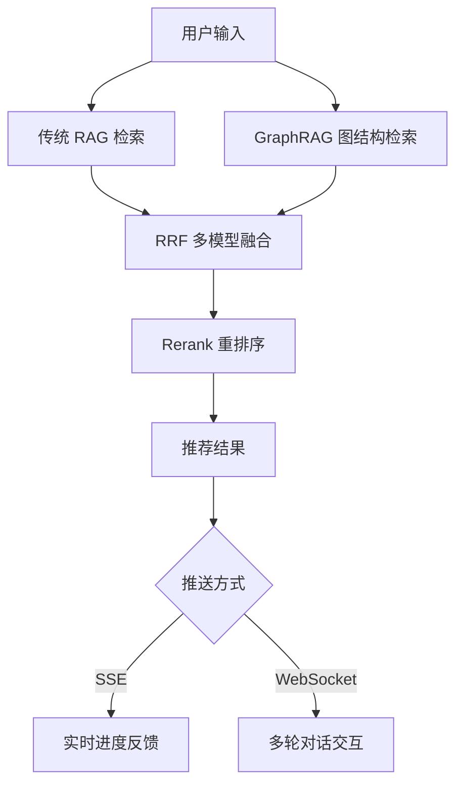

# 🌍 智能旅行推荐系统 - Where to Travel

> 基于 RAG + GraphRAG + RRF + Rerank 的智能旅行推荐系统

## 📖 项目简介

这是一个结合了传统 RAG（Retrieval-Augmented Generation）、GraphRAG（图结构增强）、RRF（Reciprocal Rank Fusion）和 Rerank（重排序）技术的智能旅行推荐系统。

### ✨ 核心特性

- ✅ **多模型融合推荐**：结合传统 RAG 和 GraphRAG 的优势
- ✅ **智能重排序**：通过 RRF 和 Rerank 提升推荐质量
- ✅ **实时交互**：支持 SSE 推送和 WebSocket 实时对话
- ✅ **图结构可视化**：直观展示景点关系网络
- ✅ **多维度推荐**：支持预算、季节、兴趣等多维度筛选

## 🏗️ 技术架构

### 后端技术栈
- **FastAPI** - 高性能 Web 框架
- **LangChain / LangGraph** - 智能体编排
- **Neo4j** - 图数据库（GraphRAG）
- **ChromaDB / FAISS** - 向量数据库（传统 RAG）
- **Qwen** - 大语言模型

### 前端技术栈
- **Vue 3** - 渐进式框架
- **Vite** - 构建工具
- **Pinia** - 状态管理
- **Element Plus** - UI 组件库
- **ECharts / D3.js** - 图表可视化

## 📁 项目结构

```
travel_proj/
├── backend/                    # 后端服务
│   ├── app/
│   │   ├── api/               # API 路由
│   │   │   ├── rag.py         # 传统 RAG 接口
│   │   │   ├── graph_rag.py   # GraphRAG 接口
│   │   │   ├── rrf.py         # RRF 融合接口
│   │   │   ├── rerank.py      # Rerank 接口
│   │   │   ├── sse.py         # SSE 推送接口
│   │   │   └── websocket.py   # WebSocket 接口
│   │   ├── core/              # 核心模块
│   │   │   ├── rag_engine.py  # RAG 引擎
│   │   │   ├── graph_engine.py # 图检索引擎
│   │   │   ├── rrf_engine.py  # RRF 融合引擎
│   │   │   └── rerank_engine.py # 重排序引擎
│   │   ├── models/            # 数据模型
│   │   ├── services/          # 业务服务
│   │   └── utils/             # 工具函数
│   ├── data/                  # 数据文件
│   │   ├── destinations/      # 景点数据
│   │   └── vector_store/      # 向量存储
│   ├── config/                # 配置文件
│   ├── requirements.txt       # Python 依赖
│   └── main.py               # 应用入口
├── frontend/                  # 前端应用
│   ├── src/
│   │   ├── components/        # 组件
│   │   │   ├── SearchInput.vue      # 搜索输入
│   │   │   ├── GraphVisualization.vue # 图可视化
│   │   │   ├── RecommendationList.vue # 推荐列表
│   │   │   ├── SSEProgress.vue      # SSE 进度
│   │   │   └── ChatInterface.vue    # 聊天界面
│   │   ├── views/             # 页面
│   │   ├── stores/            # 状态管理
│   │   ├── api/               # API 调用
│   │   ├── utils/             # 工具函数
│   │   └── App.vue           # 根组件
│   ├── package.json          # 前端依赖
│   └── vite.config.js        # Vite 配置
├── docs/                      # 文档
│   ├── PRD.md                # 产品需求文档
│   ├── API.md                # API 文档
│   └── DEPLOY.md             # 部署文档
└── docker-compose.yml        # Docker 编排
```

## 🚀 快速开始

### 📋 环境要求

- Python 3.9+
- Node.js 16+
- Neo4j 5.0+ (推荐使用 Neo4j Desktop)
- Redis (可选)

### ⚡ 快速启动（推荐 - 无需 Docker）

**详细步骤请查看：[无 Docker 快速启动指南](QUICKSTART_NO_DOCKER.md)**

```powershell
# 1. 配置环境变量
Copy-Item backend\.env.example backend\.env
# 编辑 backend\.env 文件，配置通义千问 API Key 和 Neo4j 密码

# 2. 安装依赖
.\setup_backend.ps1
.\setup_frontend.ps1

# 3. 启动 Neo4j Desktop（手动启动图形界面）
# 下载地址: https://neo4j.com/download/

# 4. 初始化数据
.\init_data.ps1

# 5. 启动服务（两个终端）
.\start_backend.ps1   # 终端 1
.\start_frontend.ps1  # 终端 2

# 6. 访问应用
# 前端: http://localhost:5173
# 后端: http://localhost:8000
# API文档: http://localhost:8000/docs
```

### 🐳 Docker 部署（可选）

```bash
# 一键启动所有服务
docker-compose up -d

# 查看日志
docker-compose logs -f

# 停止服务
docker-compose down
```

## 📊 推荐流程



## 🔧 核心功能

### 1. 传统 RAG 推荐
基于向量相似度检索相关景点文档，提供基础推荐。

### 2. GraphRAG 推荐
构建景点-季节-预算-兴趣的图结构，提供逻辑推理能力。

### 3. RRF 融合
融合多个检索模型的结果，通过倒数排名融合提升推荐质量。

### 4. Rerank 重排序
使用 LLM 对推荐结果进行二次排序，确保最符合用户意图。

### 5. 实时交互
- **SSE**：实时推送推荐进度
- **WebSocket**：支持多轮对话，动态优化推荐

## 📝 API 文档

### 主要接口

| 接口 | 方法 | 说明 |
|------|------|------|
| `/api/rag` | GET | 传统 RAG 推荐 |
| `/api/graph_rag` | GET | GraphRAG 推荐 |
| `/api/rrf` | POST | RRF 融合推荐 |
| `/api/rerank` | POST | 重排序推荐 |
| `/api/sse/recommend` | GET | SSE 实时推荐 |
| `/api/ws/chat` | WebSocket | 多轮对话推荐 |
| `/api/history` | GET | 推荐历史 |

详细文档请查看 [API.md](docs/API.md)

## 🎯 使用示例

### 基础推荐

```python
# 发送请求
GET /api/rag?query=适合家庭旅游的海边城市&budget=5000&season=summer

# 返回结果
{
    "status": "success",
    "results": [
        {
            "name": "三亚",
            "score": 0.95,
            "reason": "适合夏季家庭旅游，海滩优美",
            "budget": 4500,
            "tags": ["海边", "家庭友好", "夏季"]
        }
    ]
}
```

### 多模型融合

```python
# RRF 融合推荐
POST /api/rrf
{
    "query": "冬季适合情侣的城市",
    "models": ["rag_model_1", "graph_rag", "rag_model_2"]
}
```

### WebSocket 交互

```javascript
// 前端 WebSocket 连接
const ws = new WebSocket('ws://localhost:8000/api/ws/chat');

ws.send(JSON.stringify({
    query: "推荐一个适合带孩子的地方",
    preferences: {
        budget: 3000,
        duration: 3,
        interests: ["自然", "亲子"]
    }
}));

ws.onmessage = (event) => {
    const result = JSON.parse(event.data);
    console.log(result);
};
```

## 🗄️ 数据准备

### 景点数据格式

```json
{
    "name": "三亚",
    "location": "海南省",
    "description": "热带海滨旅游城市，拥有优质海滩...",
    "tags": ["海边", "热带", "度假"],
    "best_season": ["冬季", "春季"],
    "budget_range": [3000, 8000],
    "suitable_for": ["家庭", "情侣", "朋友"],
    "features": ["海滩", "潜水", "海鲜"],
    "rating": 4.8
}
```

### 图结构数据

```cypher
// Neo4j 图数据示例
CREATE (d:Destination {name: '三亚', location: '海南'})
CREATE (s:Season {name: '冬季'})
CREATE (t:Tag {name: '海边'})
CREATE (b:Budget {range: '3000-5000'})
CREATE (d)-[:BEST_IN]->(s)
CREATE (d)-[:HAS_TAG]->(t)
CREATE (d)-[:FITS_BUDGET]->(b)
```

## 🧪 测试

```bash
# 运行后端测试
cd backend
pytest tests/

# 运行前端测试
cd frontend
npm run test
```

## 📦 部署

详细部署文档请查看 [DEPLOY.md](docs/DEPLOY.md)

### 生产环境建议

- 使用 Nginx 反向代理
- 配置 HTTPS 证书
- 使用 Redis 缓存推荐结果
- 配置日志收集和监控
- 使用容器编排（Kubernetes）

## 🤝 贡献指南

欢迎贡献代码！请遵循以下步骤：

1. Fork 本仓库
2. 创建特性分支 (`git checkout -b feature/AmazingFeature`)
3. 提交更改 (`git commit -m 'Add some AmazingFeature'`)
4. 推送到分支 (`git push origin feature/AmazingFeature`)
5. 开启 Pull Request

## 📄 许可证

本项目采用 MIT 许可证 - 详见 [LICENSE](LICENSE) 文件

## 📞 联系方式

- 项目维护者：[Your Name]
- 邮箱：[your.email@example.com]
- 项目地址：[GitHub Repository URL]

## 🙏 致谢

- [LangChain](https://github.com/langchain-ai/langchain)
- [FastAPI](https://fastapi.tiangolo.com/)
- [Vue.js](https://vuejs.org/)
- [Neo4j](https://neo4j.com/)

---

⭐ 如果这个项目对你有帮助，请给我们一个 Star！
