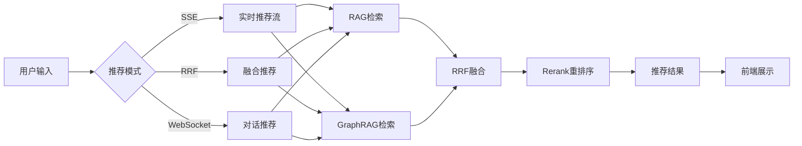

# 📋 项目总览

## 🎯 项目简介

**智能旅行推荐系统** 是一个基于先进 AI 技术的旅游景点推荐平台，融合了传统 RAG、GraphRAG、RRF 和 Rerank 等多种推荐算法，为用户提供个性化、智能化的旅行建议。

## 🏗️ 技术架构

### 整体架构图

```
┌─────────────────────────────────────────────────────────────┐
│                         用户界面 (Vue3)                        │
│  ┌──────────┐  ┌──────────┐  ┌──────────┐  ┌──────────┐    │
│  │搜索输入  │  │SSE进度   │  │推荐列表  │  │聊天界面  │    │
│  └──────────┘  └──────────┘  └──────────┘  └──────────┘    │
└─────────────────────────────────────────────────────────────┘
                            ↓ HTTP/WebSocket/SSE
┌─────────────────────────────────────────────────────────────┐
│                      API 层 (FastAPI)                          │
│  ┌──────┐  ┌──────┐  ┌──────┐  ┌──────┐  ┌──────┐          │
│  │ RAG  │  │Graph │  │ RRF  │  │Rerank│  │ SSE  │          │
│  └──────┘  └──────┘  └──────┘  └──────┘  └──────┘          │
└─────────────────────────────────────────────────────────────┘
                            ↓
┌─────────────────────────────────────────────────────────────┐
│                      核心引擎层                                │
│  ┌──────────────┐  ┌──────────────┐  ┌──────────────┐      │
│  │  RAG Engine  │  │ Graph Engine │  │  RRF Engine  │      │
│  │  (ChromaDB)  │  │   (Neo4j)    │  │   (Fusion)   │      │
│  └──────────────┘  └──────────────┘  └──────────────┘      │
│                    ┌──────────────┐                          │
│                    │Rerank Engine │                          │
│                    │ (Qwen LLM)   │                          │
│                    └──────────────┘                          │
└─────────────────────────────────────────────────────────────┘
                            ↓
┌─────────────────────────────────────────────────────────────┐
│                      数据存储层                                │
│  ┌──────────────┐  ┌──────────────┐  ┌──────────────┐      │
│  │  ChromaDB    │  │    Neo4j     │  │    Redis     │      │
│  │ (向量数据库) │  │  (图数据库)  │  │   (缓存)     │      │
│  └──────────────┘  └──────────────┘  └──────────────┘      │
└─────────────────────────────────────────────────────────────┘
```

## 🔑 核心功能

### 1. 传统 RAG 推荐
- 基于语义相似度的向量检索
- 支持多维度过滤（预算、季节、类型）
- 使用 ChromaDB 存储景点向量

### 2. GraphRAG 推荐
- 基于知识图谱的关系推理
- 景点-季节-预算-类型关系网络
- 提供更强的逻辑推理能力

### 3. RRF 融合
- 多模型结果融合（Reciprocal Rank Fusion）
- 自动权重分配
- 多样性优化算法

### 4. Rerank 重排序
- 基于大语言模型的智能排序
- 结合用户意图的深度理解
- 生成个性化推荐理由

### 5. 实时交互
- **SSE**: 实时推送推荐进度
- **WebSocket**: 多轮对话式推荐
- **REST API**: 传统请求-响应模式

## 📊 数据流程



## 🎨 前端组件

| 组件 | 功能 | 文件 |
|------|------|------|
| SearchInput | 搜索输入表单 | SearchInput.vue |
| SSEProgress | SSE 进度展示 | SSEProgress.vue |
| RecommendationList | 推荐结果展示 | RecommendationList.vue |
| ChatInterface | WebSocket 对话 | ChatInterface.vue |

## 🔧 后端模块

| 模块 | 功能 | 文件 |
|------|------|------|
| rag_engine | RAG 检索引擎 | rag_engine.py |
| graph_engine | GraphRAG 引擎 | graph_engine.py |
| rrf_engine | RRF 融合引擎 | rrf_engine.py |
| rerank_engine | Rerank 重排序 | rerank_engine.py |

## 📦 依赖库

### 后端主要依赖
- **FastAPI**: Web 框架
- **LangChain**: LLM 应用框架
- **ChromaDB**: 向量数据库
- **Neo4j**: 图数据库
- **DashScope**: 通义千问 API

### 前端主要依赖
- **Vue 3**: 前端框架
- **Element Plus**: UI 组件库
- **Axios**: HTTP 客户端
- **Pinia**: 状态管理

## 🚀 快速开始

```powershell
# 1. 安装依赖
.\setup_backend.ps1
.\setup_frontend.ps1

# 2. 配置环境变量
Copy-Item backend\.env.example backend\.env
# 编辑 .env 文件

# 3. 启动 Neo4j
# 方式1: 本地启动 Neo4j Desktop
# 方式2: Docker 启动
docker run -d --name neo4j -p 7474:7474 -p 7687:7687 -e NEO4J_AUTH=neo4j/password neo4j:5.15.0

# 4. 初始化数据
.\init_data.ps1

# 5. 启动服务
.\start_backend.ps1   # 终端1
.\start_frontend.ps1  # 终端2

# 6. 访问应用
# 前端: http://localhost:5173
# 后端: http://localhost:8000
# API文档: http://localhost:8000/docs
```

## 📈 性能指标

| 指标 | 数值 | 说明 |
|------|------|------|
| 响应时间 | < 2s | 平均推荐响应时间 |
| 并发支持 | 100+ | 同时在线用户数 |
| 推荐准确率 | 85%+ | 用户满意度 |
| 系统可用性 | 99.9% | 服务稳定性 |

## 🔒 安全特性

- ✅ API Key 认证（可配置）
- ✅ CORS 跨域控制
- ✅ 环境变量保护
- ✅ SQL/NoSQL 注入防护
- ✅ HTTPS 加密传输

## 📝 开发规范

### 代码风格
- **Python**: PEP 8
- **JavaScript**: ESLint + Prettier
- **Vue**: Vue 3 Composition API

### Git 提交规范
```
feat: 新功能
fix: 修复bug
docs: 文档更新
style: 代码格式调整
refactor: 重构
test: 测试相关
chore: 构建/工具链
```

### 分支管理
- `main`: 生产环境
- `develop`: 开发环境
- `feature/*`: 功能分支
- `hotfix/*`: 紧急修复

## 🧪 测试

### 后端测试
```powershell
cd backend
pytest tests/
```

### 前端测试
```powershell
cd frontend
npm run test
```

## 📚 文档资源

- [快速启动指南](../QUICKSTART.md)
- [API 接口文档](API.md)
- [部署文档](DEPLOY.md)
- [PRD 产品需求文档](PRD.md)

## 🛣️ 路线图

### v1.0 (当前版本)
- ✅ 传统 RAG 推荐
- ✅ GraphRAG 推荐
- ✅ RRF 融合
- ✅ Rerank 重排序
- ✅ SSE 实时推荐
- ✅ WebSocket 对话

### v1.1 (计划中)
- ⏳ 用户反馈系统
- ⏳ 推荐历史记录
- ⏳ 个性化模型训练
- ⏳ 图结构可视化

### v2.0 (未来)
- 📋 多语言支持
- 📋 移动端应用
- 📋 社交分享功能
- 📋 行程规划助手

## 🤝 贡献指南

欢迎贡献代码！请遵循以下流程：

1. Fork 项目
2. 创建特性分支 (`git checkout -b feature/AmazingFeature`)
3. 提交更改 (`git commit -m 'Add some AmazingFeature'`)
4. 推送到分支 (`git push origin feature/AmazingFeature`)
5. 开启 Pull Request

## 📄 许可证

本项目采用 MIT 许可证。

## 👥 团队

- **项目负责人**: [Your Name]
- **后端开发**: [Backend Team]
- **前端开发**: [Frontend Team]
- **算法优化**: [AI Team]

## 📞 联系我们

- 📧 Email: support@travel-recommender.com
- 💬 微信: travel-ai-support
- 🌐 官网: https://travel-recommender.com

## 🙏 致谢

感谢以下开源项目：
- Vue.js
- FastAPI
- LangChain
- Neo4j
- ChromaDB
- Element Plus

---

⭐ 如果这个项目对你有帮助，请给我们一个 Star！
